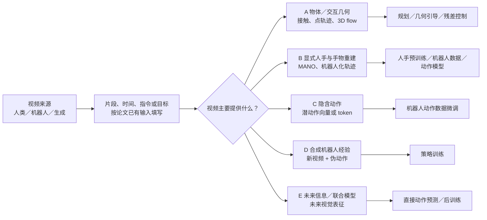

# 16 篇论文 Pipeline 逻辑图绘制说明

依据：[人类视频到机器人操作：论文方法 Pipeline 对照](人类视频到机器人操作_论文方法Pipeline对照.md)。这份文档是**画图稿**：规定图的顺序、节点写什么、哪些箭头分叉。建议画 **1 张总图 + 5 张路线图**；路线 B 的图在一张画布内分成三条泳道。每张图读法均为从左到右。节点里最多写“环节／输出／技术名”，长解释留在图下注释。

## 画图时先统一三个约定

1. **实线箭头**表示该论文真实的方法顺序；**虚线箭头**表示跨路线关系或“可选使用”，不要让读者误以为所有论文都经过同一个组件。
2. 节点形状建议：矩形＝数据处理，圆角矩形＝模型训练，六边形＝中间表示，双边框＝最终输出。论文名放在节点内的第二行，技术名放第三行。
3. 对齐要标明**对齐什么**：时间、像素/相机/世界坐标、人手与机器人形态、动作字段、视觉外观、未来表征。不要只写一个“对齐”节点。

## 图 0：总图，只画分叉位置

**顺序：** `数据来源 → 整理片段与条件 → 选择从视频取什么 → 五条路线 → 控制或训练出口`。前两个节点是阅读问题，不意味着每篇论文都实现相同的预处理。

在五个路线节点下分别写论文名：

| 路线 | 论文 | 图中应强调的共同输出 |
|---|---|---|
| A | VidBot、Track2Act、Dream2Flow | 物体或交互目标；后面还有规划/控制 |
| B | VITRA、Being-H0、Being-H0.5、Being-H0.7、Masquerade、Ego2Robot、Qwen-RobotManip、Do as I Do | 显式手或机器人动作；并非每篇都去手/渲染 |
| C | LAPA、LAWM、JALA | 无物理单位的潜动作；需要控制适配 |
| D | DreamGen | 离线合成视频，再补伪动作 |
| E | LDA-1B、Being-H0.7 | 未来表征作为训练信号；H0.7 在 B、E 两图交叉引用 |

总图旁加三条虚线注释：`Dream2Flow：推理时生成未来视频 → A`；`DreamGen：训练前生成机器人视频 → D`；`JALA：有手标签分支连接 B/C`。Being-H0、H0.5、H0.7 可以画一个“系列演进”虚线，不画成一条数据流水线。

## 图 A：物体／交互几何路线

**横向主轴：** `输入与目标条件 → 视觉定位/跟踪 → 3D 或交互表示 → 机器人桥梁 → 控制出口`。三条并列泳道。共享列名，**不共享同一个表示节点**。

| 节点顺序 | VidBot | Track2Act | Dream2Flow |
|---|---|---|---|
| A1 输入与条件 | EPIC-KITCHENS RGB + 语言 | 人/机器人网页视频；起始图 + 目标图 | 当前机器人 RGB-D + 语言 |
| A2 视频/相机准备 | SfM/EpicFields 相机轨迹；单目深度 | CoTracker 生成训练用 2D track 监督 | **额外前置节点：**图生视频模型生成任务未来视频 |
| A3 前景/对象提取 | hand-object detector + SAM；E2FGVI 去手 | 起始点与目标图条件下，DiT 扩散预测未来 2D tracks | Grounding DINO + SAM2 物体 mask；CoTracker3 跟踪物体点 |
| A4 几何与坐标 | 静态区域联合优化尺度、相机位姿、深度；提 3D 手中心轨迹 | **部署时**初始 RGB-D 抬点到 3D；RANSAC + PnP/重投影优化拟合刚体变换 | SpatialTrackerV2 逐帧深度；生成首帧与真实 RGB-D 对齐尺度；点轨迹转 3D object flow |
| A5 中间表示 | 接触点 `c` + 目标点 `g` + 路径 `τ` | 物体逐时刻刚体运动 | 物体上点的 3D flow |
| A6 机器人桥梁 | 粗 contact/goal heatmap，细 1D U-Net 轨迹扩散；TSDF 几何代价引导 | 刚体变换作用到初始 EEF，生成开环粗轨迹 | PyRoki/轨迹优化、推送动力学或 SAC 跟踪 flow；抓取可用 AnyGrasp/HaMeR 线索 |
| A7 出口 | 3D 交互轨迹交给规划 | **额外尾部节点：**少量机器人示范训练 residual policy，闭环修正 | 规划或 RL 生成机器人动作 |

**在图边缘标红两个时间差异：** Track2Act 的深度用于部署阶段的 3D 抬升；Dream2Flow 的生成视频用于推理时提出目标。VidBot 的轨迹扩散是轨迹预测，不是生成 RGB 视频。

## 图 B：显式手／手物路线

先画一条共同短主轴：`视频/已有手数据 → 手或手物表示 → [保留人手／改成机器人／物理重定向] → 训练或可播放轨迹`。在第二个节点处分成 **B1 保留人手、B2 机器人化、B3 灵巧手物理重定向** 三条泳道。只有 B2 的视觉合成支路包含“去人→渲染机器人”。

### B1 泳道：保留人手表示，之后学机器人动作

| 节点顺序 | VITRA | Being-H0 | Being-H0.5 | Being-H0.7 |
|---|---|---|---|---|
| B1-1 数据/手标签 | 多源视频；HaWoR 双手 MANO | MoCap/VR/RGB；已有标签拟合 MANO 或 HaMeR | UniHand-2.0；HaWoR 人手 + 多机器人数据 | 沿用 UniHand-2.0 格式的人/机器人轨迹 |
| B1-2 相机/时间/质量 | **独有重点：**背景光流判相机；DroidCalib 或 MoGe-2+DeepCalib；MegaSAM 相机轨迹；世界系手腕平滑与速度极小值切原子动作 | 弱透视相机规范化、视角/深度增强；片段与 1 秒窗口 | HaWoR 相机估计；置信度/DBA/抖动过滤、镜像去偏 | 沿用 H0.5 的数据与统一动作接口；新增方法重点在模型训练 |
| B1-3 指令/表示 | 未来掌心轨迹叠帧 + GPT-4.1 指令；连续双手动作 | Gemini-2.5-Flash-Lite/Pro 标注；MANO-D162 → Part-Level GRQ token | Gemini-2.5 双层标注；MANO 腕部放 EEF 槽、手指放 fine-manipulation 槽；机器人也进统一槽 | 当前历史/状态 + latent queries；训练期未来图像编码为 future embeddings |
| B1-4 训练 | PaliGemma-2/SigLIP/Gemma-2 + DiT 动作专家 | InternVL3：视觉/文字/离散手 token 自回归 | InternVL3.5 MoT；连续 flow matching + 离散手 token masked prediction；MoF 专家 | **新增训练分支：**V-JEPA2.1/ViT + Perceiver 未来 posterior，与当前 prior 隐藏态对齐；norm/rank 正则 + 双支 flow loss |
| B1-5 机器人出口 | 真实灵巧手微调；MANO 与机器人关节拓扑映射及 mask | 状态投影 + action queries + MLP 后训练连续动作 | 统一动作槽位 + 特定形态后训练；MPG/UAC 部署 | 推理只保留当前 prior，直接输出动作；未来 posterior 删除 |

**要在图里单独画出的差别：** VITRA 的“相机→稳定世界系轨迹→切片→指令”是一段独立前处理；H0 的 GRQ 是离散手 token；H0.5 是人/多机器人共用动作槽位；H0.7 的未来图像支路**仅在训练时存在**。H0.5 的世界系相对 EEF 与下方 Qwen 的相机系 EEF 增量不能合并为一个“坐标统一”算法。

### B2 泳道：人类视频机器人化

| 节点顺序 | Masquerade | Ego2Robot | Qwen-RobotManip |
|---|---|---|---|
| B2-1 来源与手 | EPIC-KITCHENS；HaMeR 21 点 | 已有手标签，或 Ego Play 经 WiLoR + DynHaMR；Qwen3.5 切任务 | 开源真实机器人 + 原始人手 + Ego2Robot 式 H2R + VLM 数据 |
| B2-2 人手→夹爪 | Phantom → 双 Kinova EEF/开口 | 拇指尖 + `0.7 食指尖 + 0.3 中指尖` → 虚拟 TCP/开口；Savitzky–Golay/SLERP 平滑 | H2R 用 MANO→夹爪；此外统一多来源真实机器人动作 |
| B2-3 去人/视觉合成 | Detectron2 + SAM2 → E2FGVI → 已知相机参数下机器人 2D overlay | SAM3(person) → ProPainter → 基座搜索/MuJoCo IK/15 形态渲染 → Depth Anything V3 遮挡 | H2R 支路沿用 SAM3/ProPainter/MuJoCo IK/Depth Anything V3 |
| B2-4 **各自额外节点** | Homography 把未来点 warp 到当前视角；过滤大相机运动 | L1 IK/物理、L2 统计、L3 Qwen3.5 语义清洗 | **三层对齐：**UnifiedSpace 80 维+mask；UnifiedEEF 相机系增量+CaPE/内参；历史+形态提示做行为对齐；真实数据另做时序/FK/TCP 清洗 |
| B2-5 训练/出口 | ViT-Base + DistilBERT/FiLM 预测未来 **2D 点**；真实数据 Diffusion Policy，继续人视频辅助损失 | 合成机器人视频/相对 EEF 动作/指令 + 真实数据 → Qwen3.5/DiT flow VLA | Qwen3.5-4B + DiT flow；VLA/VLM 双流联合训练，再目标域后训练 |

**图中的分支：** Masquerade 的 2D waypoint 预训练不要画成“恢复可靠绝对 3D”。Ego2Robot 在合成后有清洗支路；Qwen-RobotManip 则在 H2R 数据之外另接“真实机器人数据清洗”“VLM 辅助任务”两条输入线。B2-3 中的“去人”是视觉编辑；B2-2 才是动作重定向。

### B3 泳道：Do as I Do 的额外手—物理支路

按顺序写：`ego/exo 单目 RGB → SAM3 手/物 mask → HaWoR 手 + MoGe 深度/内参 → SAM 3D 物体 mesh → guided diffusion 逐帧 6D 物体姿态 → 手物尺度/位姿对齐 + GeoCalib 重力 → 物理仿真 MPPI 风格灵巧手重定向 → 可播放机器人轨迹`。

在“物体姿态”节点旁加小支路：`点轨迹估角速度 → 姿态引导；候选姿态聚类 + mask-IoU 选择`。在“物理重定向”旁加小支路：`warmup + 随机力扰动 + 接触/离手 transition reward`。终点标注为**轨迹/数据**，不画成“已训练通用 VLA”。SAM3 分割与 SAM 3D 建模是两个不同节点。

## 图 C：潜动作路线

**横向主轴：** `无动作标签视频 → 用前后观测形成潜动作 → 用视频训练表示/策略 → 有动作机器人数据适配 → 机器人动作`。潜动作节点统一标 `z`，并在图下注明“没有固定米/弧度单位”。

| 节点顺序 | LAPA | LAWM | JALA |
|---|---|---|---|
| C1 输入 | 当前帧 + 未来帧 | 当前图 + 指令 + 未来帧 | Ego4D 野外视频 + 有标签手数据；WiLoR/Gemini 过滤与标注 |
| C2 潜动作怎样来 | VQ-VAE/NSVQ 编码帧变化为离散 token；当前帧+token 重建未来帧 | 策略预测连续潜动作，DreamerV3 RSSM 世界模型用其预测未来帧 | LAP 看片段起止帧得潜动作；LSP 看当前上下文；EMA/joint alignment 对齐两侧 |
| C3 **额外监督** | 离线给无动作视频贴 token 伪标签 | 未来帧 MSE + RSSM KL 联合训练 | **额外有标签支路：**MANO→GRQ token，masked chunk prediction；无标签片段只做 latent alignment |
| C4 策略训练 | VLM 当前图+文本→潜动作 token | BAKU/DP 风格策略与世界模型共同训练 | 当前 VLA 隐藏态与 LAP latent 对齐，不要求完整像素重建 |
| C5 机器人出口 | 少量真实动作数据替换/微调真实动作头 | 微调时丢世界模型，保留策略并改动作头 | DiT flow-matching 机器人动作头后训练 |

不要把 JALA 的有标签手支路隐藏在“无标签视频”节点下；它是这篇论文与 LAPA/LAWM 的核心差异。

## 图 D：合成视频造训练数据

这一图主要是 DreamGen。**顺序：** `少量目标机器人遥操作视频 → Wan2.1 + LoRA 微调视频模型 → 初始图+指令生成新机器人视频 → 给生成视频补标签（二选一） → neural trajectories → 策略训练`。

在“补标签”处分两条箭头：

| 分支 | 节点文字 | 后续含义 |
|---|---|---|
| D-IDM | `SigLIP-2 + DiT flow IDM：前后帧→目标机器人动作伪标签` | IDM 本身需要目标机器人有动作数据 |
| D-LAPA | `LAPA：前后帧→离散潜动作` | 潜动作需进一步适配控制 |

两路合到 `生成视频 + 指令 + 伪动作/潜动作`，再接 `Diffusion Policy / π0 / GR00T N1`。图角落注明**离线数据制作**。Dream2Flow 放在图 A 的“推理时目标生成”，这里仅用虚线指向 A 作比较。

## 图 E：未来信息与数据质量

这张图画**两条并列泳道**，共同标题是“未来怎样帮助当前模型”，不把两篇的 latent 画成同一种量。

| 节点顺序 | LDA-1B | Being-H0.7 |
|---|---|---|
| E1 数据 | EI-30k：高/低质量有动作数据 + 无动作视频；统一 LeRobot、指令、坐标与质量标签 | UniHand-2.0 格式的人/机器人轨迹；当前图像/状态/指令，训练时有未来图像 |
| E2 未来信息 | 冻结 DINO 将**未来图像**编码为视觉 latent | V-JEPA2.1/冻结 ViT + Perceiver 从未来图像得到 posterior embeddings |
| E3 分配训练任务 | MM-DiT 四任务：policy、forward dynamics、inverse dynamics、visual forecasting；高质量动作做策略/动力学，低质量动作侧重动力学，无动作视频做视觉预测 | 当前 prior latent queries 与训练期 future posterior 隐藏态对齐；norm/rank 正则；两支均有 flow 动作损失 |
| E4 推理/出口 | 按任务条件预测动作或未来视觉 latent；目标机器人后训练 | 推理删除未来 posterior，仅当前 prior 直接输出动作 |

在 LDA-1B 的 E3 节点画**按数据质量分流**，而不是让所有数据都做 policy loss。在 H0.7 的 E2/E3 节点加“训练期专用”括号；推理箭头必须绕开未来图像。LDA-1B 的 **DINO future latent** 是视觉状态表示，LAPA/LAWM/JALA 的 **latent action** 是变化/动作表示。

## 最后一张小索引：同一步，各篇具体用了什么

若总图周围还有空间，放这个小表作为“看图索引”；详细方法只展开在对应路线图。

| 想比较的环节 | 论文与方法 | 在哪张图找 |
|---|---|---|
| 视频分段/语义 | VITRA：手速极小值切片 + GPT-4.1；Ego2Robot：Qwen3.5 子任务；Being-H 系列/JALA：Gemini 标注 | B1、B2、C |
| 分割与去人 | VidBot：hand-object detector/SAM + E2FGVI；Masquerade：Detectron2/SAM2 + E2FGVI；Ego2Robot/Qwen：SAM3 + ProPainter；Do as I Do：SAM3 手/物 mask | A、B2、B3 |
| 点/手/物跟踪 | Track2Act：CoTracker；Dream2Flow：CoTracker3；VITRA：HaWoR；Masquerade：HaMeR；Ego2Robot：WiLoR/DynHaMR；Do as I Do：HaWoR + SAM 3D 物体姿态 | A、B |
| 深度/相机/坐标 | VidBot：SfM/EpicFields + 单目深度；Track2Act：部署时 RGB-D + PnP；Dream2Flow：SpatialTrackerV2 + RGB-D 首帧；VITRA：DroidCalib/MoGe-2/DeepCalib/MegaSAM；Do as I Do：MoGe/GeoCalib；Qwen：相机系 EEF + CaPE | A、B |
| 人→机器人 | Masquerade：Phantom；Ego2Robot：虚拟夹爪 + MuJoCo IK；Do as I Do：物理 MPPI；VITRA/H0：人手表示后训练；H0.5/Qwen：多形态统一动作槽位 | B |
| 无动作视频监督 | LAPA：VQ token；LAWM：RSSM 未来帧；JALA：LAP/LSP 对齐；DreamGen：IDM/LAPA 补标签；LDA-1B：未来 DINO latent | C、D、E |

**检查整套图是否画对：** 沿任意一篇论文的实线走，能说出其输入、每一步产物、坐标/动作含义和最终出口；独有步骤能在分支里找到；读者不会把 2D track、MANO、潜动作、3D flow 或生成视频误认成可直接发送给真机的动作。

---

## 附录：16 篇论文各自的一张流程图

这一部分可直接作为 16 张独立图的文字底稿。每篇严格按**数据来源 → 切片/标注 → 视觉提取 → 坐标表示 → 跨形态接口 → 训练目标/微调 → 测试输入**检查，再给出实际的画图箭头。七项是核对清单，**箭头以论文真实处理先后为准**；训练期和测试期、并行数据源要分泳道。`未说明`表示不应自行补画算法，`无此步骤`表示方法不需要该环节。技术名依据本地原论文的方法部分；数据集/模型版本以论文写法为准。这里不记录最终测评数字。

### A1. VidBot：RGB 人类视频到 3D 可供性

- **数据从哪来：** EPIC-KITCHENS 的第一人称 RGB 人类操作视频与任务语言；视频本身没有真实机器人动作和深度。机器人部署时使用现场观测。
- **如何切片、标注：** 从操作片段提取初始接触、目标与手中心路径，以语言条件关联任务；不是给每帧标机器人关节动作。
- **视觉提取什么：** SfM/EpicFields 求相机轨迹、稀疏地标与内参；ZoeDepth、Metric3D v2、Depth Anything 等单目深度候选；hand-object detector 与 SAM 得手/物 mask；E2FGVI 去手；静态背景约束联合调整相机、深度和尺度。
- **输出在哪个坐标系：** 像素手/物信息经深度与相机位姿抬到**带尺度的相机/世界 3D**；供测试使用的可供性表示最终在**当前观测相机系**。画图时在“手轨迹→3D”处标出坐标变换。
- **怎样跨人/机器人形态：** 人手压缩为接触点 `c`、目标点 `g`、路径 `τ`；不直接学习人的指关节到某台机器人关节的映射。
- **训练目标是什么：** CLIP 语言特征 + Perceiver 融合的粗 contact/goal 热图；细阶段用 1D U-Net diffusion 生成 3D 轨迹；测试时 TSDF/3D U-Net 几何信息与碰撞、目标、接触代价引导采样。不是 VLA 动作头微调。
- **测试时还需要什么：** 当前场景的 RGB-D 或可用深度、相机几何、语言目标，以及把轨迹接到机器人的规划/控制系统。

**画图箭头：** `RGB+语言 → SfM/EpicFields + 单目深度`，与 `hand-object detector+SAM → E2FGVI` 汇合 → `尺度/相机/深度一致化 → 3D 手中心轨迹 → c/g/τ 标签 → 粗热图模型 → 细轨迹扩散`；另画测试支路 `现场 RGB-D → TSDF 几何代价 → 引导轨迹采样 → 机器人规划`。[原文](papers/VidBot/VidBot.pdf)

### A2. Track2Act：目标图条件的点轨迹

- **数据从哪来：** 网页人类/机器人视频；学习点轨迹时不要求这些视频有机器人动作。另用少量目标机器人的真实示范训练残差策略。
- **如何切片、标注：** 从视频取起始图与目标图，CoTracker 对视频点进行跟踪，形成起始点及未来 2D track 监督；任务条件是**目标图像**。
- **视觉提取什么：** CoTracker 自动提供训练 track；DiT diffusion 在起始图、目标图和初始点条件下预测整段未来 2D 点轨迹。它没有先为网页视频统一恢复 MANO 或 3D 物体网格。
- **输出在哪个坐标系：** 网络输出是**图像像素 2D**；部署时用当前 RGB-D 与内参把初始点抬为相机 3D，再用 RANSAC + PnP/重投影优化逐时刻求物体刚体运动，转换为机器人 EEF 粗轨迹。
- **怎样跨人/机器人形态：** 转移**物体运动**而非复制人手；将估计刚体变换作用于初始 EEF，再由机器人专属 residual policy 修正。
- **训练目标是什么：** 网页视频上训练条件式扩散点轨迹模型；少量真实机器人示范训练闭环 residual policy。不是在网页视频上训练直接输出关节角的 VLA。
- **测试时还需要什么：** 起始 RGB-D、目标图像、相机内参、初始抓取/EEF 关系，以及残差策略所需现场机器人观测。

**画图箭头：** `网页视频 → CoTracker 2D 轨迹伪标签 → 起始图+目标图+起始点 → DiT diffusion → 未来 2D tracks`；测试分支 `现场 RGB-D → 3D 抬点 → RANSAC/PnP 刚体变换 → EEF 开环粗计划`，再接独立训练支路 `少量机器人示范 → residual policy → 闭环动作`。[原文](papers/Track2Act/Track2Act.pdf)

### A3. Dream2Flow：推理时生成未来视频并跟踪物体

- **数据从哪来：** 当前机器人场景的 RGB-D、已知相机投影和语言任务；**推理时**调用现成图生视频模型生成可能的完成过程。没有从这些生成视频构造离线通用 VLA 训练集。
- **如何切片、标注：** 语言指定目标；生成的视频给出未来物体运动序列，不需要为每段人工标机器人动作。生成过程从当前场景首帧开始。
- **视觉提取什么：** Grounding DINO 定位物体、SAM2 给 mask、CoTracker3 跟踪物体点；SpatialTrackerV2 估计生成视频每帧深度；真实首帧 RGB-D 校准生成深度的尺度/偏移。
- **输出在哪个坐标系：** 2D tracks + 校准深度 + 相机内外参 → **机器人坐标系 3D object flow**；要把相机运动与物体运动区分开。
- **怎样跨人/机器人形态：** 用物体流作为目标；不同机器人通过轨迹优化、推送技能或 RL 达成相似物体运动。真实抓取可用 AnyGrasp 候选，生成视频里 HaMeR 拇指线索辅助选抓取部位。
- **训练目标是什么：** 方法核心是**推理时目标生成和控制**；图生视频模型作为现成组件使用，后段可用 PyRoki 优化 EEF 轨迹，或在任务仿真中用 flow 奖励训练 SAC。没有统一的“Dream2Flow VLA 预训练/微调”节点。
- **测试时还需要什么：** 当前 RGB-D、相机内外参、语言、图生视频模型、目标物分割/跟踪、规划器或 RL 控制器；生成场景需符合近似静态相机假设。

**画图箭头：** `现场 RGB-D+语言 → 图生视频生成未来帧 → Grounding DINO+SAM2 → CoTracker3 点轨迹`，并行 `生成帧 → SpatialTrackerV2 深度 → 与首帧 RGB-D 校准`，汇合 `3D object flow → PyRoki/推送优化或 SAC → 机器人动作`。[原文](papers/Dream2Flow/Dream2Flow.pdf)

### B1. VITRA：移动相机视频变成人手 VLA episode

- **数据从哪来：** Ego4D、EPIC-KITCHENS、EgoExo4D、Something-Something-V2 等人类视频；多为第一人称，也覆盖其他来源，初始视频没有可靠连续手动作与逐段指令。后续另需真实灵巧手数据。
- **如何切片、标注：** 背景光流判断相机是否运动；世界系双手腕速度极小值把长视频拆成原子动作。每段抽 8 帧叠加未来掌心轨迹，GPT-4.1 生成含动作、物体、环境的指令。
- **视觉提取什么：** 运动相机用 DroidCalib 求内参，静止相机可用 MoGe-2 + DeepCalib；HaWoR 恢复双手 MANO；修改版 MegaSAM 求相机轨迹；MoGe-2 辅助尺度。这里没有 E2FGVI/ProPainter 去手。
- **输出在哪个坐标系：** 通过相机轨迹把手运动稳定到世界系，训练动作再按模型需要转为当前相机/手的相对表示；双手状态与缺失手槽位分开记录。图上应区分**世界系轨迹恢复**和**模型动作表示**。
- **怎样跨人/机器人形态：** 先在人手 MANO 动作上预训练；真实灵巧手微调时按手指拓扑映射 MANO 与机器人关节，缺失维度用 mask，而不是去手后渲染机器人。
- **训练目标是什么：** PaliGemma-2 体系（SigLIP 视觉编码、Gemma-2 语言骨干）+ DiT 连续动作扩散专家，预测未来双手动作；因果动作去噪/有效时间 mask 处理变长片段；再用真实机器人动作数据微调。
- **测试时还需要什么：** 图像、FoV/相机信息、指令、当前手或机器人状态、适配目标机器人后的动作输出接口；机器人控制依赖微调数据与映射。

**画图箭头：** `多源视频 → 背景光流判相机 → DroidCalib 或 MoGe-2+DeepCalib`，并行 `HaWoR MANO + MegaSAM 相机轨迹`，汇合 `世界系双手动作 → 速度极小值切片 → 轨迹叠帧+GPT-4.1 指令 → 人手 VLA 预训练 → 真实灵巧手动作微调`。[原文](papers/Vitra/vitra_paper.pdf)

### B2. Being-H0：连续 MANO 到离散手 token

- **数据从哪来：** MoCap、VR、RGB 视频等组成 UniHand；来源可能已有 3D 手标签、只有 3D 关键点或仅 RGB。另有真实机器人数据用于后训练。
- **如何切片、标注：** 视频整理为操作片段与约 1 秒动作窗口；Gemini-2.5-Flash-Lite 生成分层物理动作描述，Gemini-2.5-Pro 扩展指令模板。
- **视觉提取什么：** 已有手参数直接转 MANO；关键点拟合 MANO；无标签 RGB 用 HaMeR 估手。通过弱透视相机规范化和视角/深度增强处理不同拍摄条件；不把它画成完整动态相机 SLAM、物体 6D 或去人渲染。
- **输出在哪个坐标系：** MANO-D162 描述手形态与腕/指动作；弱透视相机对齐图像投影，统一不同来源的手表示。离散 GRQ token **不是**物理坐标里的电机命令。
- **怎样跨人/机器人形态：** 人手 token 预训练获得动作先验；机器人状态投影与 learnable action queries/MLP 后训练，学习连续机器人动作，不逐 token 直接转换成关节指令。
- **训练目标是什么：** Part-Level GRQ 分别量化腕/指；InternVL3/InternViT 视觉语言骨干做视觉/指令→手动作、动作→文字、历史→未来手动作等自回归任务；后训练连续机器人动作头。
- **测试时还需要什么：** 当前图像、指令、机器人本体状态和已适配的动作头；不需推理时重新做视频去手或预测物体 mesh。

**画图箭头：** `MoCap/VR/RGB → 直接 MANO／关键点拟合／HaMeR 三路汇合 → 弱透视对齐与动作片段 → Gemini 指令 → MANO-D162 → Part-Level GRQ token → InternVL3 预训练`；另接 `机器人状态+动作示范 → action queries/MLP 后训练 → 连续动作`。[原文](papers/BeingH0/BeingH0.pdf)

### B3. Being-H0.5：人手与多机器人统一动作槽位

- **数据从哪来：** UniHand-2.0：第一人称人手、多机器人真实/仿真操作与视觉语言数据；UniCraftor 是另一个便携采集来源，并非处理任意互联网 RGB 的必经设备。
- **如何切片、标注：** 人手片段用 Gemini-2.5 做分层语义标注；置信度、DBA、腕部抖动、非操作片段等过滤，左右镜像减轻偏置。多机器人数据保留形态、状态、动作与任务字段。
- **视觉提取什么：** 野外人手用 HaWoR 恢复 MANO/相机；本论文重点在统一表示与大规模训练，**没有**给所有输入统一安排去手/渲染步骤。
- **输出在哪个坐标系：** Unified State-Action Space：MANO 腕部占共享 EEF 槽，手指占 fine-manipulation 槽；机器人映射到相应槽并用 mask 标有效维。EEF 使用**世界系相对位移**，旋转 axis-angle，关节绝对弧度。
- **怎样跨人/机器人形态：** 统一语义槽位 + 掩码；MoF 用共享底层与形态/任务专门动作专家；具体机器人后训练，而不是对每条人视频先做 IK 与机器人视觉渲染。
- **训练目标是什么：** InternVL3.5 初始化的 MoT；连续动作块 flow matching，离散手 motion token masked prediction，并保留视觉语言任务；后训练面向目标形态。MPG/UAC 是部署时稳定/异步 chunk 处理模块。
- **测试时还需要什么：** 当前图像、指令、目标机器人状态和槽位映射、目标形态动作专家/后训练权重、实际控制接口；不要求测试时重建人手。

**画图箭头：** `UniHand-2.0 人手/机器人/VL 三源 → HaWoR+Gemini/质量过滤（人手支路） → 统一状态动作槽位+mask → InternVL3.5 MoT`，模型节点分叉 `连续 flow matching` 与 `离散 motion token masked prediction`，合到 `MoF + 目标形态后训练 → MPG/UAC 部署`。[原文](papers/BeingH0.5/BeingH0.5.pdf)

### B4. Being-H0.7：训练期未来信息教当前动作

- **数据从哪来：** 沿用 UniHand-2.0 格式的人/机器人轨迹与动作，训练时可取同一轨迹的未来图像；机器人动作数据用于动作学习/适配。
- **如何切片、标注：** 使用当前历史观测、指令、状态和未来动作块构造样本；未来图像只给训练期 posterior。论文重点不在新的视频自动切片或语言标注器。
- **视觉提取什么：** 当前图像进入 VLA 视觉编码；未来图像由 V-JEPA2.1/冻结 ViT 和 Perceiver 编为 future embeddings。此处没有新提出 SAM 分割、去人或深度重建流程。
- **输出在哪个坐标系：** 动作沿用统一机器人动作表示；latent queries/posterior embeddings 是模型隐藏表征，**没有米/弧度坐标含义**，不能画成 3D 轨迹。
- **怎样跨人/机器人形态：** 继承统一动作空间和形态适配；新增的是未来监督，而非一种新的人手到夹爪几何映射。
- **训练目标是什么：** 当前可部署 prior 与看到未来的 posterior 共用骨干/动作生成路径；对齐 latent query 隐藏态，加入 norm/rank 防塌缩约束，两支都做 flow-matching 动作损失。推理时只保留 prior。
- **测试时还需要什么：** 当前图像/历史、指令、状态和目标机器人动作接口；**无需未来真实帧，也不在线生成未来视频**。

**画图箭头：** 主路 `当前观测+指令+状态 → latent queries/prior → flow 动作头 → 机器人动作`；训练专用支路 `真实未来图像 → V-JEPA2.1/ViT+Perceiver → posterior → 隐藏态对齐+双支动作损失`。把 posterior 箭头画到损失节点，不画到测试输入。[原文](papers/BeingH0.7/BeingH0.7.pdf)

### B5. Masquerade：编辑人类视频训练视觉表示

- **数据从哪来：** EPIC-KITCHENS 的人类操作视频、手标注与活动文本；另有少量单场景真实机器人示范用于策略微调。人视频没有准确的机器人动作标签或可靠绝对 3D 深度。
- **如何切片、标注：** 以活动片段和文本作训练单位；视频中的未来手/机器人位置对应当前帧；大相机移动片段会过滤。Homography 把未来关键点 warp 到当前相机视角。
- **视觉提取什么：** HaMeR 求每手 21 个关键点；Detectron2 + SAM2 求手/人区域；E2FGVI 修复去人后的背景；利用已知相机参数渲染机器人外观，再做 2D overlay。
- **输出在哪个坐标系：** 编辑视频与未来 waypoint 的监督主要在**图像 2D 像素坐标**；Phantom 把手关键点转换成双 Kinova EEF 姿态/夹爪开口，渲染时使用相机参数。不要把 2D waypoint 画成测得的世界系 3D 轨迹。
- **怎样跨人/机器人形态：** Phantom 做手→平行夹爪动作映射，E2FGVI+机器人叠图缩小视觉外观差；外观编辑与动作映射要画成两个步骤。
- **训练目标是什么：** ViT-Base 视觉编码 + DistilBERT/FiLM 语言条件预测未来 2D 机器人关键点；用真实机器人数据训练 Diffusion Policy 动作头，微调时继续保持编辑人视频的 2D waypoint 辅助损失（co-training）。
- **测试时还需要什么：** 真实机器人相机观测、任务语言和经过微调的策略/控制接口；**不需要**部署时对现场图像再次去人或合成人类视频。

**画图箭头：** `EPIC 视频+文本 → HaMeR → Phantom 机器人姿态`；并行 `Detectron2+SAM2 → E2FGVI 去人 → 机器人渲染/2D overlay`；两路汇合 `Homography 未来点对齐 → ViT-Base+DistilBERT/FiLM 2D waypoint 预训练`；旁路 `少量真实机器人示范 → Diffusion Policy` 与前路做 co-training。[原文](papers/Masquerade/Masquerade.pdf)

### B6. Ego2Robot：人类第一人称视频合成多形态机器人数据

- **数据从哪来：** 两路第一人称视频：ANT/EgoDex/VITRA/EgoVerse 等已有手姿标签的数据，以及纯 Ego Play 视频；最终混入真实机器人示范训练。原始人视频不是天然机器人动作数据。
- **如何切片、标注：** 已有手标签的数据按示范片段整理；纯视频路径由 Qwen3.5 切分/标注子任务；合成结果经过 L1 物理/IK、L2 统计、L3 Qwen3.5 语义一致性清洗。
- **视觉提取什么：** 无手标签路径用 WiLoR 估手、SAM3 检验、DynHaMR 做时序优化；SAM3(person) 分割人体，ProPainter 去人；Depth Anything V3 估场景深度，用于与机器人渲染深度做遮挡合成。
- **输出在哪个坐标系：** 手部几何转虚拟夹爪 TCP/开口/方向；经过候选机器人基座搜索和 MuJoCo IK，得到形态对应轨迹；训练标签用**参考相机系相对 EEF 动作**。原图像像素、重建手坐标、机器人基座、相机系动作必须分开画。
- **怎样跨人/机器人形态：** 拇指尖与 `0.7 食指尖 + 0.3 中指尖` 组成虚拟夹爪；Savitzky–Golay 平滑位置/开口、SLERP 平滑旋转；对 15 种机器人做基座搜索、IK 和渲染。
- **训练目标是什么：** 合成机器人视频+动作+指令与真实机器人示范混合，预训练 Qwen3.5 视觉语言骨干配 DiT flow-matching 动作专家；论文关注数据合成与混合训练，不能把前处理错写成一种 SAM3 VLA。
- **测试时还需要什么：** 目标机器人相机与状态、指令、该形态的动作解释/控制接口和策略权重；SAM3、ProPainter 是**造训练数据**环节，通常不在每次控制时运行。

**画图箭头：** `已有手标签` 与 `纯视频→WiLoR/SAM3/DynHaMR+Qwen3.5 切任务` 汇合 → `虚拟夹爪+平滑`；并行 `SAM3 人 mask→ProPainter 去人`；汇合 `基座搜索+MuJoCo IK→15 形态渲染→Depth Anything V3 遮挡→L1/L2/L3 清洗→合成训练集`，再与 `真实机器人示范` 汇合到 `Qwen3.5+DiT flow VLA`。[原文](papers/Ego2Robot/Ego2Robot.pdf)

### B7. Qwen-RobotManip：异构来源的三层对齐

- **数据从哪来：** 开源真实机器人示范、原始人手视频、Ego2Robot 式 H2R 合成机器人视频和视觉语言数据；并非只输入一类人视频。真实示范含实际机器人状态/动作，原始人视频未必有。
- **如何切片、标注：** 真实机器人轨迹做突变、时序、FK/TCP、坐标与视觉/语义一致性清洗；H2R 片段有任务指令；结构化 system prompt 给形态、速度、fps、视角信息；VLM 流另含 ECoT、第一人称视频理解、2D 轨迹预测等任务。
- **视觉提取什么：** H2R 支路沿用手→夹爪、SAM3 人体分割、ProPainter 去人、MuJoCo IK/渲染、Depth Anything V3 深度遮挡；真实机器人数据支路**不必**经过人手分割。模型侧用相机内参 patch 编码与 CaPE。
- **输出在哪个坐标系：** UnifiedSpace 80 维语义状态/动作模板 + 有效维 mask 解决字段对齐；UnifiedEEF 使用**参考相机系相对 EEF 增量**解决不同相机下数值不一致；CaPE/内参帮助视觉与运动对齐。此定义不同于 H0.5 的世界系动作。
- **怎样跨人/机器人形态：** H2R 先把人变机器人数据；再用统一槽位、相机系运动表示和历史上下文/形态提示做表示、运动、行为三层对齐。
- **训练目标是什么：** Qwen3.5-4B VLM + DiT flow-matching 动作专家；VLA 操作任务与 VLM 任务双流联合训练，随后目标域后训练。要画成两类数据源进入共同骨干，不是“先训练 Ego2Robot 再单独训练 Qwen”的必经串联。
- **测试时还需要什么：** 当前多视角图像、内参/相机定义、机器人状态、指令、历史上下文及目标形态动作接口；有效维 mask 和动作反变换必须一致。

**画图箭头：** `真实机器人清洗` 与 `人视频→H2R 合成` 汇合 → `UnifiedSpace 80D+mask → UnifiedEEF 相机系增量+CaPE → 行为提示/历史上下文`；并行 `VLM/ECoT 等数据` → `Qwen3.5-4B+DiT flow 双流训练 → 目标域后训练 → 动作`。[原文](papers/Qwen-RobotManip/Qwen-RobotManip.pdf)

### B8. Do as I Do：手—物共同重建与灵巧手物理重定向

- **数据从哪来：** 第一/第三人称普通单目 RGB 人类视频，也可输入生成视频；没有预先给定深度、动作或机器人示范。方法目标是从观察生成灵巧操作数据。
- **如何切片、标注：** 按操作 clip 处理，追踪手和刚体物体的整个时序；论文重点不是用 GPT/VLM 自动生成逐段指令。接触/离手阶段在后续物理优化中区别处理。
- **视觉提取什么：** SAM3 分割手与物体；HaWoR 追踪 3D 手与相机；MoGe 估深度/相机内参；SAM 3D 单帧估物体 mesh，再用 guided diffusion 在固定形状下估逐帧 6D 物体姿态；点轨迹估角速度，候选姿态聚类+mask-IoU 筛选。
- **输出在哪个坐标系：** 手、物、相机对齐到一致的近度量 3D；GeoCalib 对齐重力方向；物体 6D 与手腕/手指运动一起送入仿真机器人坐标。该尺度与姿态仍受单目估计误差影响。
- **怎样跨人/机器人形态：** 在物理仿真中用 MPPI 风格采样优化将手—物交互转为机器人多指灵巧手与机械臂轨迹；warmup、随机力扰动、接触/离手 transition reward 提高可播放性。不是把人手简单合并成平行夹爪。
- **训练目标是什么：** 核心是视觉重建与**优化生成机器人轨迹**；此流程**没有**预训练某个 VLA 或规定其微调动作头。后续可用输出做数据，但应另画为下游。
- **测试时还需要什么：** 输入视频、可用的手/物重建模型、目标灵巧手机器人模型与物理仿真/优化器；输出轨迹需按目标硬件接口验证。

**画图箭头：** `单目视频 → SAM3 手/物 mask`；分叉 `HaWoR+MoGe → 3D 手/相机` 与 `SAM 3D mesh → guided diffusion 6D 物体跟踪`，汇合 `手物尺度/位姿+GeoCalib 重力对齐 → MPPI 风格物理重定向 → 机器人可播放轨迹`。在物体跟踪和物理优化各画技术旁支。[原文](<papers/Do as  I Do/Do as I do.pdf>)

### C1. LAPA：离散潜动作三阶段

- **数据从哪来：** 无动作标签的人类操作视频和机器人视频；任务文本/描述用于 VLA 预训练。少量有真实动作的机器人数据只在最终适配阶段使用。
- **如何切片、标注：** 从同一片段取当前帧与后续帧构成前后对；第一阶段学到量化器后，给无动作视频离线打**潜动作 token 伪标签**。论文不要求手/物体逐帧 mask 或接触标注。
- **视觉提取什么：** 视觉编码器读前后帧；action quantization model 用 encoder 得潜变量，VQ-VAE/NSVQ 量化为离散 token，decoder 在当前帧+token 条件下重建未来帧。
- **输出在哪个坐标系：** token 是离散潜空间符号，**不属于像素、相机、世界或机器人关节坐标**；背景或相机运动也可能被编码进去。
- **怎样跨人/机器人形态：** 人/机器人无标签视频共用潜动作预训练；目标机器人有标签数据微调真实动作输出头，学习落到实际控制空间。
- **训练目标是什么：** 阶段一未来帧重建/量化；阶段二 VLM 用当前图+任务文本预测潜动作 token；阶段三替换/微调真实机器人动作头。不是在第一阶段直接回归米/弧度动作。
- **测试时还需要什么：** 当前图像、任务文本和微调后的真实动作头/机器人控制接口；不再输入真实未来帧给编码器。

**画图箭头：** `无动作视频帧对 → VQ-VAE/NSVQ 编码-量化-未来帧重建 → 潜动作 token 伪标签 → 当前图+文本的 VLM 预训练`；另接 `少量机器人真动作 → 替换/微调动作头 → 机器人动作`。[原文](papers/LAPA/LAPA.pdf)

### C2. LAWM：潜动作由世界模型未来帧约束

- **数据从哪来：** 无动作标签的人类示范视频用于预训练；目标机器人有动作示范用于后续微调。可采用不同模仿策略骨干，论文实现包含 BAKU/Diffusion Policy 类设置。
- **如何切片、标注：** 从视频取当前图、指令和未来帧序列；没有先离线训练 VQ token 标注器，也不需要为人视频做手臂分割/去手。
- **视觉提取什么：** 策略编码当前观测并预测连续潜动作块；DreamerV3 风格 RSSM 世界模型用当前帧与潜动作预测后续帧。图中将“策略”与“世界模型”画成并行闭环训练模块。
- **输出在哪个坐标系：** 预训练潜动作是模型连续潜空间向量，没有固定物理单位；后训练输出才对应目标机器人动作空间。
- **怎样跨人/机器人形态：** 视频阶段学视觉运动先验；微调时移除世界模型，保留策略并适配真实机器人动作头。
- **训练目标是什么：** 未来帧重建 MSE + RSSM KL 等自监督损失联训策略与世界模型；有标签机器人微调时做动作模仿。不是 VLA/VLM 大底座从零预训练的必然流程。
- **测试时还需要什么：** 当前机器人图像/状态与指令、已微调的策略和动作接口；世界模型与真实未来帧**不在推理路径**。

**画图箭头：** `无动作视频当前图+指令 → 策略预测潜动作 → RSSM(当前帧, 潜动作) → 未来帧重建损失 → 更新策略+世界模型`；之后 `删除世界模型 → 有动作机器人数据微调策略/动作头 → 控制`。[原文](papers/LAWM/LAWM.pdf)

### C3. JALA：显式手标签与无标签潜动作联合

- **数据从哪来：** UniHand-Mix 含实验室高质量手数据和 Ego4D 野外视频；后者通常缺可靠连续手标签。目标机器人有动作数据用于后训练。
- **如何切片、标注：** 野外视频经 WiLoR 看手，Gemini-2.5-Flash 判别真实操作并标任务；可选 HaWoR 产生高置信伪手标签。把样本按“有 MANO 标签/无 MANO 标签”分两路施加损失。
- **视觉提取什么：** 有标签路把 MANO 动作经 GRQ 离散化；无标签路的 LAP 看片段起止帧产生 latent action，LSP 看当前上下文。视觉表征可用 DINOv3/V-JEPA2；EMA 稳定潜空间对齐。
- **输出在哪个坐标系：** MANO/GRQ 是显式手动作及其 token；LAP latent 和当前 VLA 隐藏态是非物理潜空间；机器人动作需目标动作头输出，三者不能合并成同一坐标节点。
- **怎样跨人/机器人形态：** 用联合预训练共享预测表示；机器人后训练以该隐藏态条件化 DiT flow-matching 动作头。没有要求对野外每段视频先做人手→夹爪 IK。
- **训练目标是什么：** 有手标签片段做 GRQ motion token 的 masked chunk prediction，同时做 LAP/LSP latent alignment；无标签片段主要做 latent alignment；后训练机器人动作 flow matching。不要求像 LAPA/LAWM 那样重建完整未来像素。
- **测试时还需要什么：** 当前图像/历史、指令/状态、机器人动作头；LAP 的“真实未来帧”只用于训练监督，不可画成部署输入。

**画图箭头：** `UniHand-Mix → 有 MANO 标签 / 野外无标签`；有标签支路 `MANO→GRQ→masked chunk`，两路共同 `边界帧→LAP latent ↔ 当前上下文→LSP/VLA 隐藏态对齐`，汇合 `机器人有动作数据 → DiT flow 头后训练 → 动作`。[原文](papers/JALA/JALA.pdf)

### D1. DreamGen：生成机器人视频并回填伪动作

- **数据从哪来：** 少量人遥操作的**目标机器人**视频，通常有指令与真实动作；可使用机器人数据中的多视角视频。生成阶段另给初始图和新任务/场景指令，产出合成机器人视频。
- **如何切片、标注：** 遥操作轨迹提供片段与指令；生成视频按新初始图/语言条件形成 neural trajectories。多视角训练可拼为 2×2 网格；它不是先对人类第一人称视频逐帧分割手再去手。
- **视觉提取什么：** 以 Wan2.1 等图生视频世界模型为基础，LoRA 微调目标机器人外观/运动；生成帧没有自带动作标签。伪动作支路一用 SigLIP-2 视觉编码 + DiT flow-matching IDM，支路二用 LAPA 潜动作标注。
- **输出在哪个坐标系：** IDM 输出目标机器人动作空间里的**伪动作**，仍需核对执行含义；LAPA 输出无物理单位 token。视频像素与动作标签靠时间配对，不需要假设所有分支有世界系 3D 重建。
- **怎样跨人/机器人形态：** 视频生成模型适配目标机器人形态；IDM 由该机器人的真实动作数据学习从视觉变化回推动作。LAPA 支路通过后续真实动作适配进入机器人控制。
- **训练目标是什么：** 先 LoRA 微调视频模型；IDM 支路有动作监督，LAPA 支路潜动作自监督；最后以合成 neural trajectories 训练或混合训练 Diffusion Policy、π0、GR00T N1 等策略。图中不要把这三者画成必须依次训练的三个 VLA。
- **测试时还需要什么：** 已在合成/真实数据上训练的目标机器人策略、现场观测与动作接口；视频生成与伪动作回填**通常在离线造数阶段**完成。

**画图箭头：** `少量目标机器人遥操作视频 → Wan2.1+LoRA → 初始图+新指令 → 合成机器人视频`；从此分叉 `SigLIP-2+DiT IDM→目标动作伪标签` 或 `LAPA→潜动作 token`；汇合 `neural trajectories (+真实示范) → DP/π0/GR00T N1 策略训练`。[原文](papers/DreamGen/DreamGen.pdf)

### E1. LDA-1B：按数据质量分配未来/动作任务

- **数据从哪来：** EI-30k 混合真实/仿真机器人、有动作人手和无动作人类视频；统一为 LeRobot 格式，同时保留指令、相机外参、动作与质量信息。不同来源不是同样可靠的模仿标签。
- **如何切片、标注：** 根据样本是否有动作、动作质量和任务信息分派训练任务；视觉约 3 Hz、动作约 10 Hz，需处理异步时间对应。无动作视频不应凭空填机器人动作。
- **视觉提取什么：** 冻结 DINO 把当前/未来图像编码到视觉 latent；VLM 条件特征与任务 embedding 输入 MM-DiT。核心视觉目标是**未来 DINO 表征**，并非逐帧 RGB 像素复原；未要求统一 SAM 分割或去人。
- **输出在哪个坐标系：** 人手/机器人动作在统一手中心/EEF 相关动作空间中规范化；相机外参保留以帮助区分相机与手的运动。DINO latent 是视觉特征空间，不是物理 3D 坐标。
- **怎样跨人/机器人形态：** 数据标准化、统一动作字段与任务条件使多来源可混合；目标机器人少量有动作数据后训练完成适配。
- **训练目标是什么：** MM-DiT 四路任务：policy `当前→动作`、forward `当前+动作→未来视觉 latent`、inverse `当前+未来→动作`、forecast `当前→未来视觉 latent`。高质量有动作数据用于 policy/动力学，低质量动作侧重动力学，无动作视频用于视觉预测；不是所有样本都做动作模仿。
- **测试时还需要什么：** 根据所选任务提供当前图像/指令/状态以及必要的动作或未来条件；机器人控制时用 policy 路与目标机器人后训练动作接口，不需要测试时真实未来图像。

**画图箭头：** `EI-30k 多源数据 → LeRobot/坐标/时间/质量标准化 → DINO 未来视觉 latent`；质量门控分成 `高质量有动作→policy+动力学`、`低质量有动作→动力学`、`无动作→forecast`，共同训练 `VLM 条件+MM-DiT → 目标机器人后训练 → 动作`。[原文](papers/LDA-1B/LDA-1B.pdf)
