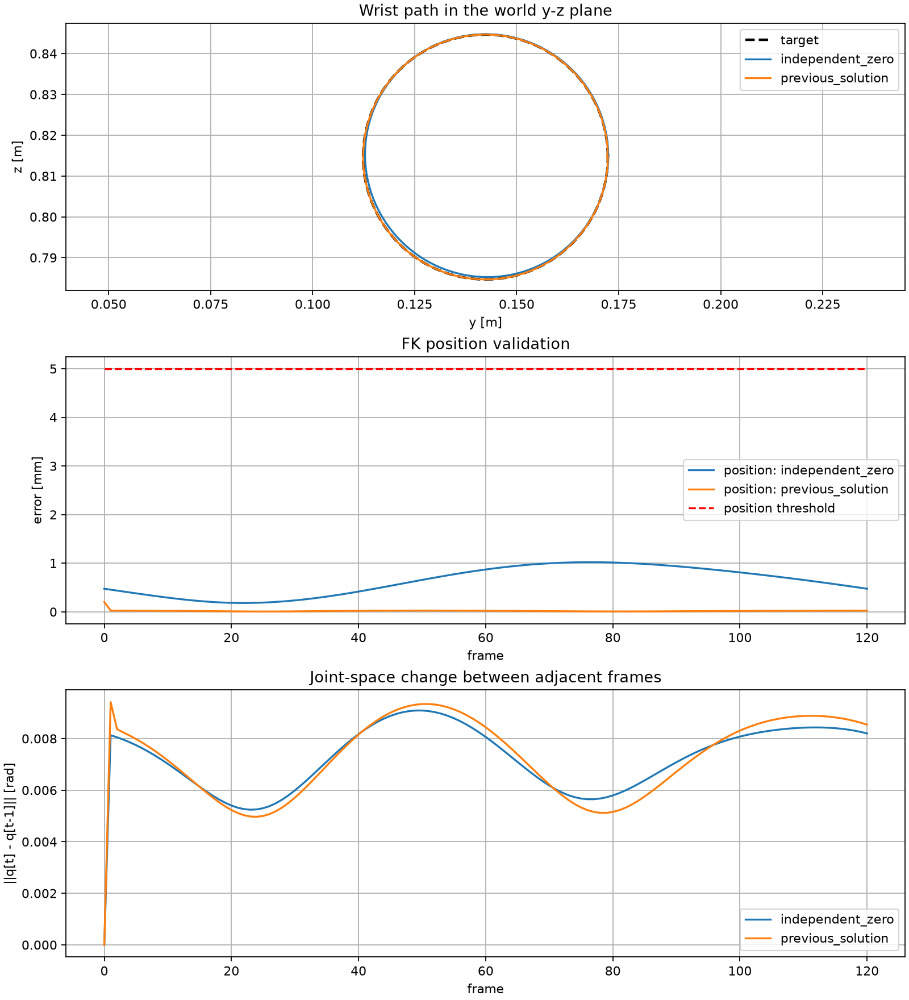
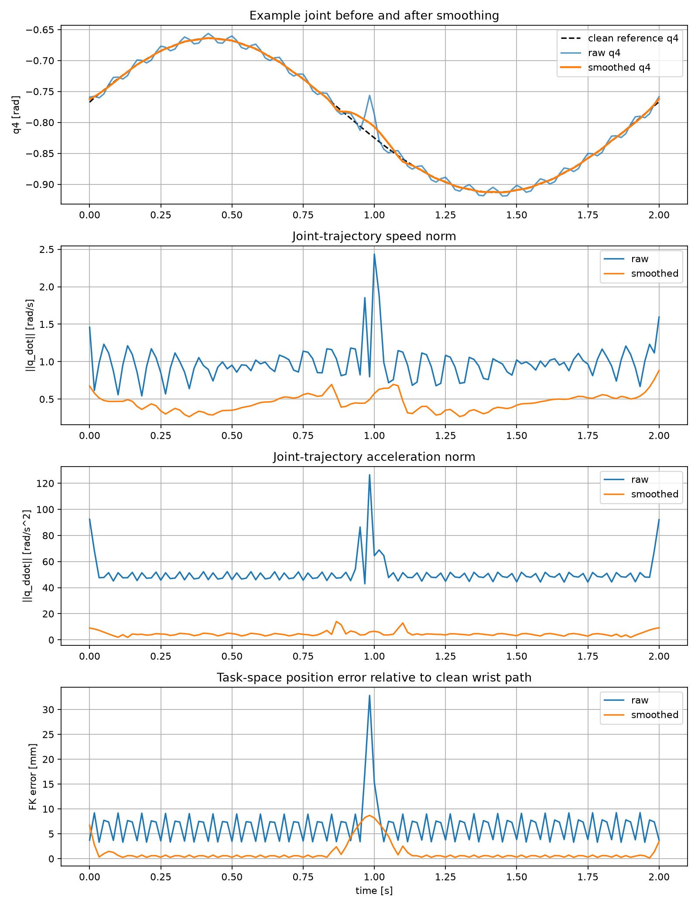
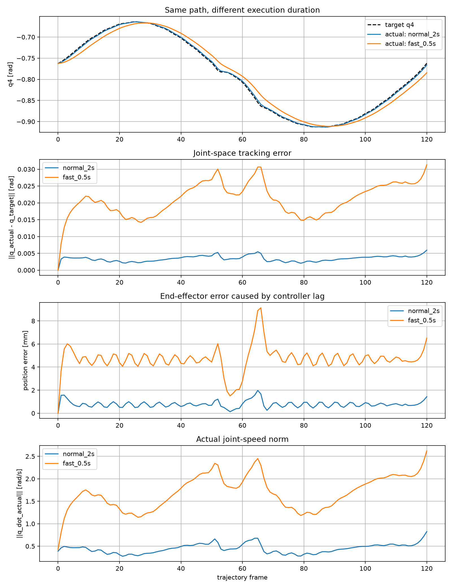
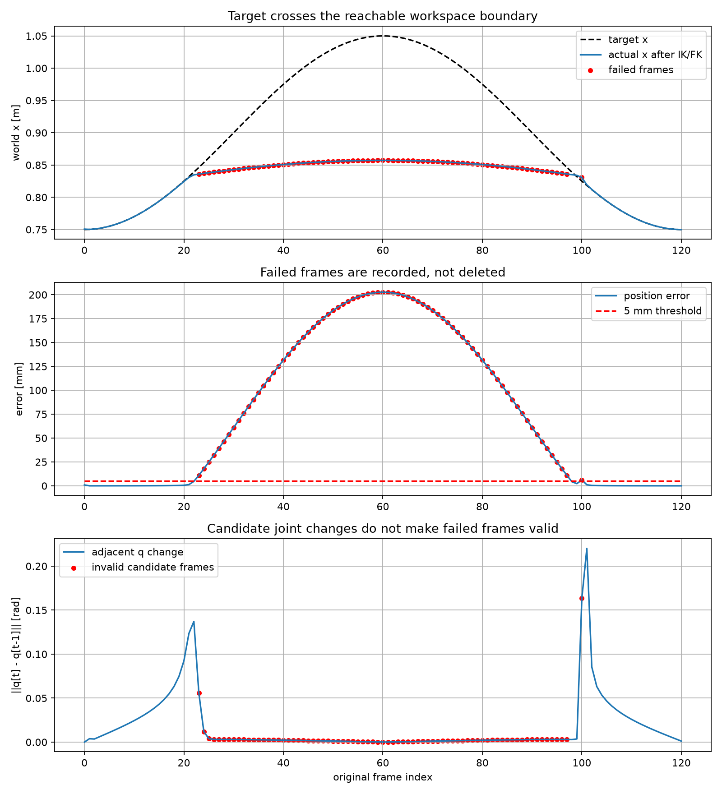

# Unit 6：论文导向综合实验报告

## 1. 输入约定

- 腕部位置 shape：`[121, 3]`
- 腕部方向 shape：`[121, 4]`
- 坐标系：`world (robot base coincident in this setup)`
- 位置单位：`m`
- 关节角单位：`rad`
- 四元数顺序：`xyzw`
- 采样率：`60.0 Hz`
- timestep：`0.016667 s`
- 总时长：`2.000 s`

## 2. 可达轨迹：IK/FK 验证

- 成功帧：`121/121`
- 最大位置误差：`0.2025 mm`
- 最大姿态误差：`0.0048 deg`
- 最大相邻关节变化：`0.009415 rad`
- 关节限位违规帧：`0`

## 3. 原始轨迹与平滑轨迹

| 指标 | 原始 | 平滑后 |
|---|---:|---:|
| 最大 FK 位置误差 (mm) | 32.8187 | 8.7097 |
| 最大速度范数 (rad/s) | 2.4346 | 0.8830 |
| 最大加速度范数 (rad/s²) | 126.4591 | 14.0607 |

## 4. Position control：正常与快速执行

| 指标 | 2 秒执行 | 0.5 秒执行 |
|---|---:|---:|
| 最大 joint tracking error (rad) | 0.005945 | 0.031319 |
| 平均 joint tracking error (rad) | 0.003427 | 0.020963 |
| 最大末端位置误差 (mm) | 1.9762 | 9.1352 |
| 最大实际速度范数 (rad/s) | 0.8258 | 2.6218 |

## 5. 边界与失败案例

- 失败帧：`76/121`
- 最大位置误差：`202.676 mm`
- 最大相邻关节变化：`0.220102 rad`
- 若删除失败帧，最大原始时间缺口：`76 frames`

## 6. 结论

1. IK 返回候选关节角后必须用 FK 回代并检查位置、姿态和关节限位。
2. 单帧 IK/FK 成功不保证关节轨迹平滑；必须检查相邻变化、速度和加速度。
3. 平滑能降低高频速度与加速度，但平滑后仍需重新验证任务空间误差。
4. 相同几何轨迹以更快时间尺度执行，会显著增大 tracking error。
5. 失败帧必须保留原始索引与失败标记，不能静默删除。
