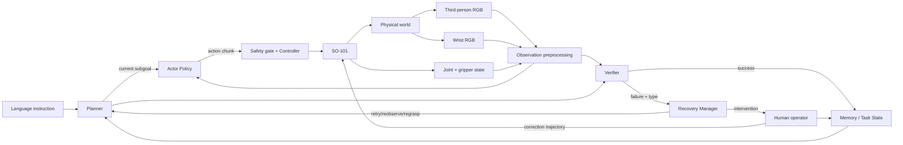

# System Architecture

## 数据与控制流

## 组件职责与禁止越界

| 组件 | 输入/输出 | 负责 | 不负责 |
|---|---|---|---|
| Observation preprocessing | 原始带时间戳传感器 → 对齐、裁剪、归一化 observation | 数据同步、缺帧/陈旧数据标记、shape/单位一致 | 判断任务完成；掩盖缺失帧 |
| Planner | 语言、task graph、memory → current subgoal | 顺序、依赖、终止和重规划 | 低层关节控制；凭空判断物理成功 |
| Actor Policy | observation + subgoal → action chunk + confidence/metadata | 产生短时动作意图 | 绕过限位；直接更新完成状态 |
| Controller/Safety Gate | action chunk + 当前关节 → 执行与状态 | 插值、频率、限幅、超时、停止 | 语义选物体；学习任务策略 |
| Verifier | 当前/前后 observation、期望效果 → verdict/evidence | 判断抓住、对象正确、放置、掉落；量化置信度 | 仅接受 Actor/LLM 的自报成功 |
| Recovery Manager | failure type、次数、状态 → recovery/介入 | 有界重试、重观察、安全位、人工接管 | 无限循环或在未知状态继续动作 |
| Memory/Task State | 事件 → 可序列化任务状态 | 保存完成项、当前目标、对象状态、尝试次数和证据 | 保存不可追溯的自然语言“感觉” |

## 核心接口契约

- `Observation`: episode/time、两路 RGB、joint positions、gripper state、有效性 mask、相机与机器人配置 ID。每个字段必须注明 shape、dtype、单位、frame、采样率和时间戳语义。
- `Subgoal`: object ID/属性、动作类型、target region、依赖项、成功谓词、最大尝试次数。
- `ActionChunk`: `[horizon, action_dim]`，默认以 follower 关节位置/夹爪目标表示；附生成时间、预期执行频率、限幅版本。执行期间必须可因急停、陈旧 observation 或 verifier 事件中断。
- `VerifierResult`: `success/failure/unknown`、failure category、evidence、confidence、使用的 frame IDs。`unknown` 必须进入重观察或人工判断。
- `TaskState`: schema version、pending/current/completed subgoals、object beliefs、attempt counts、last verifier result、intervention history。
- `ExecutionEvent`: commanded/actual action、timestamps、saturation、dropped frame、stop reason；用于区分 policy 与系统故障。

## 控制节拍

传感采集、policy inference 和 servo execution 允许不同频率，但统一单调时钟并测量端到端延迟。策略只能消费通过 freshness 阈值的完整 observation；action chunk 滚动执行并定期重规划；controller 记录期望与实测偏差。公网云端只用于训练和批量评估，不放在真机实时闭环中。

## 分层验证

1. 单元：变换、shape、单位、限幅、状态转移。
2. 回放：冻结 episode 上检查 preprocessing、Actor、Verifier 可重复。
3. 仿真闭环：扰动、延迟、丢帧、不可达目标和碰撞测试。
4. 硬件 dry-run：不使能或零运动验证命令路径。
5. 低速真机：单关节/安全位/单子目标。
6. 长时序：Verifier 和 Recovery 启用，完整事件日志。

## 架构 Gate

Entry：观察/动作定义草案和最终任务草案存在。Tasks：冻结 v0 schema；实现前先写接口测试和故障注入清单。Exit：每个组件可替换并独立回放；任务状态可从日志恢复；任何动作都经过同一安全 gate；Verifier 误判可被量化；系统故障与策略故障能分开统计。

