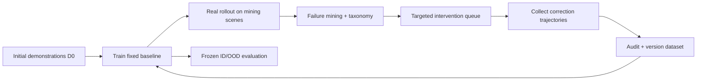

# Failure-Driven Data Loop

## 核心循环

## 实验问题与假设

问题：同样增加 N 条 trajectories，failure-targeted correction 是否比随机成功采集更有效？主假设：C 在 overall/long-horizon success 和高频故障降低上优于 B，且单位新增人类数据收益更高。若 C 只改善被定向的故障而损伤其他状态，也应报告。

## A/B/C 受控设计

| 条件 | 数据 | 采集规则 |
|---|---|---|
| A Base | 同一 `D0` | 不新增；训练与调参预算相同 |
| B Random-success | `D0 + ΔD_random` | 从预定义训练场景分布随机抽任务，采集成功 demonstration；不以当前失败优先 |
| C Failure-targeted | `D0 + ΔD_failure` | 从 base policy 真实失败队列分层抽样，在失败前/失败状态执行纠正或接管 |

公平性：主预算使用相同新增 episode/trajectory 数 N；同时报告有效控制步、总人类 teleop 时长（只作为测得量，不作日程）、帧数、subgoal 数和采集失败率。模型初始化、架构、训练 steps/early-stop 规则、augmentation、test manifest 保持一致。若 correction 片段长度不同，增加 matched-action-step 敏感性分析。

## Failure mining 与采集

1. 只在独立 mining scene pool 运行 base checkpoint，test/OOD pool 永不用于挑选数据。
2. 保存失败前上下文、失败状态、subgoal、标签、系统健康信息和 verifier evidence。
3. 排除 camera/timing/硬件故障产生的伪策略样本，单独进入 BLOCKERS。
4. 按 failure type × object/layout 分层，避免只收集最常见/最容易纠正类型。
5. 采集定义需预先选定：从相同起始场景完整重示范，或从失败状态 intervention continuation；两者不能无标签混合。
6. 审计、版本化，冻结后再训练；不得查看 test 结果后选择要加入的 episode。

## 评估与统计

Primary：overall task success、long-horizon completion、每新增 100 个等价控制步/每 N 轨迹的成功率增益。Secondary：per-subgoal success、recovery success、intervention count、failure-type distribution、OOD success、collision/safety events。报告 trial 数、点估计与置信区间/适当 bootstrap；同一 scene/seed 尽量配对。完成时间是系统指标之一，但不能被当作项目时间安排。

## 判定与负结果

C 胜出需要在预注册 primary metric 上优于 B，且不能靠更多有效动作量、额外调参或 test leakage。若差异不显著，检查统计功效、failure taxonomy 噪声、目标样本过窄和 correction 拼接方式；不可事后更换主指标。负结果仍有价值：给出失败类型、数据覆盖和成本边界。

## Gate

Entry：真机 ACT baseline、taxonomy、dataset audit、evaluation protocol 均冻结。Tasks：生成 D0、mining queue、等预算 B/C、独立训练和盲化评估。Exit：所有结果可追到 experiment/dataset/checkpoint；公平性表完整；成功和失败样例均公开；结论含限制。**Compute/Hardware**：rollout/采集 D；ACT 训练 B；统计 A；无需 A100，除非后期大 VLA 扩展。

