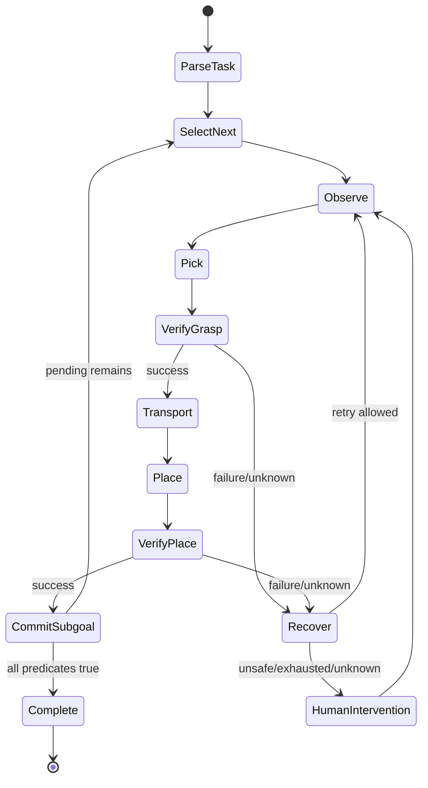

# Long-Horizon Task

## Canonical task

语言示例：“依次把红色物体、白色物体、蓝色物体放到各自指定区域。”场景含至少三个可操作物体、对应目标区和 distractor；对象初始位置与目标布局在允许范围变化。部分抓取/运输/放置会失败，系统必须验证后继续、恢复或请求介入，不能默认整条 episode 重置。

## Task graph 与状态

`Subgoal` 是带对象、动作、目标和成功谓词的最小可验证任务单元。`TaskState` 保存 instruction、task graph version、pending/current/completed、对象 belief、attempt count、最近 verifier evidence 和 intervention history。Memory 必须可序列化并从 event log 重建。

## 成功、失败与终止

- Pick success：正确对象被稳定夹持并完成 lift predicate。
- Place success：正确对象稳定落在目标区域，夹爪释放且不再携带。
- Task success：所有 subgoal 按语言顺序经 verifier 确认，无未解决安全事件。
- Recoverable failure：miss/slip/offset 等且场景可重观测、动作仍安全、尝试未超限。
- Intervention：状态不确定、碰撞/掉落位置危险、传感故障或重试耗尽。
- Termination：success、safety abort、unrecoverable、operator abort、system fault；必须显式记录。

## 分级实现

L0 单物体单目标验证状态机；L1 多物体固定顺序；L2 语言指定顺序与 distractor；L3 局部失败恢复/介入后继续；L4 OOD 位置、光照、相机扰动和未见布置。升级只改变 task graph/scene config，不改 episode 基本 schema。

## Gate

Entry：单个 pick/place baseline 稳定，Verifier 对单子目标已量化。Tasks：冻结 canonical task、reset 和 predicate；逐层实现 task state；故障注入验证恢复。Exit：状态可从中断日志恢复；未验证 subgoal 不会被提交；顺序错误可检测；局部失败后继续完成；每个终止都有原因和指标。

