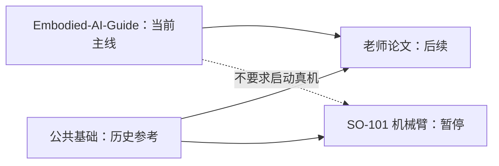

# 学习规划总览

## 当前决定

- 当前主线改为跟随仓库内的 `Embodied-AI-Guide-main` 学习，并根据 DexTele、ObjRetarget 的研究重点裁剪内容；入口见 [03_embodied_ai_guide_learning](03_embodied_ai_guide_learning/README.md)。
- 已读完《机器人学简介》，当前进入 Phase 1“机械臂仿真巩固”。
- `00_common_foundations`、`01_teacher_papers` 与旧的 `next_step.md` 保留为历史规划和后续参考，不再决定当前执行顺序。
- SO-101 机械臂项目继续暂停，不采购或连接真实硬件。

## 四部分的关系



当前按论文导向的六阶段路线学习；与上肢重定向、手物交互关系弱的硬件和导航内容不进入主线。旧公共基础文档可以查漏补缺，但不再作为顺序约束。

## 目录

```text
planning/
├── 00_common_foundations/      # 两条路线共用的最小基础
├── 01_teacher_papers/          # 老师推荐论文、阅读和小型实验
│   └── papers/                 # 论文 PDF，不包含代码
├── 02_robot_arm_project/       # 暂停的 SO-101 独立子项目
└── 03_embodied_ai_guide_learning/ # 当前 Guide 论文导向六阶段计划
```

## 使用规则

1. 当前每次学习先看 [03 总计划](03_embodied_ai_guide_learning/README.md) 及当前阶段文件；`next_step.md` 只保留旧路线记录。
2. 任务完成以笔记、代码输出、图表或可重复命令为证据。“看完了”不算完成。
3. 只有当前阶段 Gate 通过后，才创建下一阶段的详细计划文件。
4. 论文中遇到基础缺口时，可以查阅 `00_common_foundations`，但不切换回旧执行路线。
5. 机械臂子项目在明确恢复前，不占用当前学习时间。
