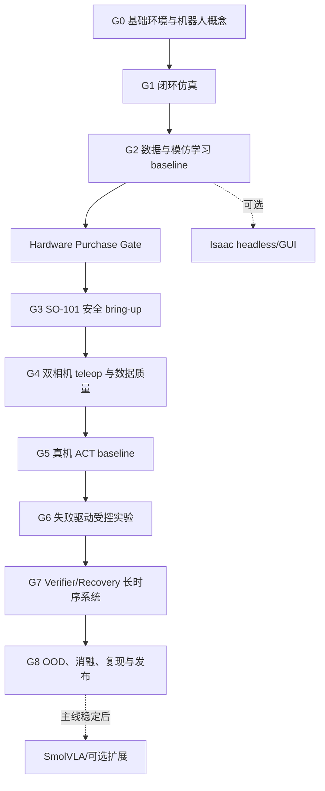

# Failure-Driven Long-Horizon Manipulation on SO-101

本目录是项目的控制面：规定目标、依赖、Gate、证据和下一步。它不是按时间排列的课程表。开始较大任务前先读本文件、[PROGRESS.md](PROGRESS.md) 与 [DECISIONS.md](DECISIONS.md)。

## 最终目标与研究问题

构建真实 SO-101 Pro 长时序桌面操作系统：语言任务经任务拆解、双相机观察、策略动作、实机执行、子任务验证、失败检测和恢复/人工介入，最终继续完成任务。

主研究问题：在相同新增轨迹预算下，针对真实策略失败状态采集的纠正数据，是否比随机增加成功 demonstrations 更有效地提高长时序任务成功率？

核心比较：

- A：基础 demonstrations；
- B：基础数据 + N 条随机成功 demonstrations；
- C：基础数据 + N 条 failure-targeted correction/intervention trajectories；
- 主要证据：整体及子目标成功率、长时序完成率、恢复率、人工介入次数、各故障类型频率、OOD 成功率与单位新增数据收益。

## 总体系统

语言指令与第三视角 RGB、腕部 RGB、关节/夹爪状态进入观察处理；Planner 根据任务状态选择子目标；Actor 输出 action chunk；Controller 以安全限幅和固定控制频率驱动 SO-101；Verifier 使用传感器和几何/学习规则判断结果；失败进入 Recovery 或人工 intervention，成功则更新 Memory/Task State。职责见 [02_SYSTEM_ARCHITECTURE.md](02_SYSTEM_ARCHITECTURE.md)。

## 阶段依赖与 Gate

| Gate | Entry criteria | 必做任务 | Exit criteria / 证据 |
|---|---|---|---|
| G0 基础 | Linux 可用；理解项目目标 | Git/环境记录；ROS2、TF、URDF、控制概念练习 | 能解释 joint/pose/frame、policy/controller；保存可复现环境说明和练习输出 |
| G1 闭环仿真 | G0 | MuJoCo 机器人、观察/动作、控制循环、故障注入 | 可重复 rollout；轨迹与指标可视化；能解释频率、延迟和失败原因 |
| G2 IL baseline | G1 | 仿真 demonstrations、数据审计、BC/ACT、固定评估 | dataset→train→rollout→failure 全链路；checkpoint、配置、量化结果齐全 |
| Hardware Purchase Gate | G2 | 阅读 LeRobot/SO-101 pipeline；列出采购与安全清单 | 能独立读懂 pipeline，且能解释 observation/state/action/policy/controller；此时可购买，不要求先完成全部仿真扩展 |
| G3 Bring-up | 设备到货；采购清单与急停方案准备好 | 机械、电机 ID、串口、标定、低速单关节、leader/follower、双相机 | 检测正常；ID 正确；标定保存；teleop 稳定；相机均可用；急停实测；无不安全运动 |
| G4 数据质量 | G3 | 双相机固定、时间同步、teleop、schema、数据审计 | 小规模数据通过完整性/同步/回放检查；失败与介入标签可记录 |
| G5 真机 baseline | G4 | ACT 训练、离线回放检查、限幅 dry-run、受控 rollout | 固定测试协议下有量化基线；失败完整记录；可安全重复执行 |
| G6 研究实验 | G5 | A/B/C 等预算数据实验、失败挖掘、定向纠正 | 多 seed/批次结果、置信区间或不确定性、故障分布和数据效率结论 |
| G7 长时序 | G6；单子目标可靠 | Planner、Task State、Verifier、Recovery、人工介入 | 多物体有序任务可从局部失败继续；状态转移和恢复均有日志与量化证据 |
| G8 发布 | G7 | OOD、有效消融、复现、报告、视频、GitHub | 不只展示成功案例；第三方可按文档复现实验；作品集材料不夸大结果 |

任何 Gate 都不能以“代码不报错”为完成条件；必须同时具备理解说明、可检查 artifact 与验证结果。

## 文档索引

| 文档 | 用途 |
|---|---|
| [00_PROJECT_CHARTER.md](00_PROJECT_CHARTER.md) | 范围、成果与非玩具标准 |
| [01_LEARNING_MAP.md](01_LEARNING_MAP.md) | 按依赖组织的学习与实操地图 |
| [02_SYSTEM_ARCHITECTURE.md](02_SYSTEM_ARCHITECTURE.md) | 最终系统组件和接口边界 |
| [03_PRE_HARDWARE_SIMULATION_PLAN.md](03_PRE_HARDWARE_SIMULATION_PLAN.md) | 设备到货前的主线模块与 Gate |
| [04_ROS2_AND_ROBOTICS_FOUNDATION.md](04_ROS2_AND_ROBOTICS_FOUNDATION.md) | 面向 SO-101 的 ROS2/机器人基础练习 |
| [05_SIMULATION_STACK.md](05_SIMULATION_STACK.md) | MuJoCo/Isaac 的角色和工作流 |
| [06_SO101_HARDWARE_BRINGUP.md](06_SO101_HARDWARE_BRINGUP.md) | 到货、安全、标定和 bring-up 清单 |
| [07_CALIBRATION_AND_SENSORS.md](07_CALIBRATION_AND_SENSORS.md) | 关节和双相机一致性要求 |
| [08_TELEOP_AND_DATA_COLLECTION.md](08_TELEOP_AND_DATA_COLLECTION.md) | teleop、数据 schema、审计与版本 |
| [09_BASELINE_POLICIES.md](09_BASELINE_POLICIES.md) | scripted、ACT、Diffusion、SmolVLA 层级 |
| [10_FAILURE_TAXONOMY.md](10_FAILURE_TAXONOMY.md) | 故障检测、原因、恢复和指标词典 |
| [11_FAILURE_DRIVEN_DATA_LOOP.md](11_FAILURE_DRIVEN_DATA_LOOP.md) | 核心 A/B/C 研究设计 |
| [12_LONG_HORIZON_TASK.md](12_LONG_HORIZON_TASK.md) | 多物体有序任务、状态机与扩展接口 |
| [13_VERIFIER_AND_RECOVERY.md](13_VERIFIER_AND_RECOVERY.md) | 可审计验证器与分级恢复 |
| [14_VLA_EXTENSION.md](14_VLA_EXTENSION.md) | 主线完成后的语言条件策略扩展 |
| [15_SIM2REAL_PLAN.md](15_SIM2REAL_PLAN.md) | Sim2Real 的价值判断与最小方案 |
| [16_EVALUATION_PROTOCOL.md](16_EVALUATION_PROTOCOL.md) | 正式指标、场景拆分和报告规则 |
| [17_ABLATION_AND_EXPERIMENTS.md](17_ABLATION_AND_EXPERIMENTS.md) | 有因果意义的消融优先级 |
| [18_COMPUTE_AND_DEPLOYMENT.md](18_COMPUTE_AND_DEPLOYMENT.md) | 本地/云端算力与部署矩阵 |
| [19_REPOSITORY_STRUCTURE.md](19_REPOSITORY_STRUCTURE.md) | 后续仓库布局与数据边界 |
| [20_REPRODUCIBILITY.md](20_REPRODUCIBILITY.md) | 环境、数据、模型和实验身份 |
| [21_GITHUB_AND_PORTFOLIO.md](21_GITHUB_AND_PORTFOLIO.md) | 可证明真实机器人工作的发布证据 |
| [22_RESUME_OUTPUT.md](22_RESUME_OUTPUT.md) | 不编造数据的简历/CV 模板 |
| [23_OPTIONAL_EXTENSIONS.md](23_OPTIONAL_EXTENSIONS.md) | 主线稳定后的扩展及准入条件 |
| [PROGRESS.md](PROGRESS.md) | 当前状态和恢复上下文 |
| [DECISIONS.md](DECISIONS.md) | 不随意漂移的设计决策记录 |
| [EXPERIMENT_LOG.md](EXPERIMENT_LOG.md) | 统一实验记录模板 |
| [BLOCKERS.md](BLOCKERS.md) | 阻塞证据、尝试和安全下一步 |
| [CONTRIBUTING_AI.md](CONTRIBUTING_AI.md) | 后续 Codex 执行与安全规则 |

现有概念资料可作为预读：[基础知识补充](../基础知识补充/00_README_三日学习说明.md)，尤其是[最小机器人学与控制基础](../基础知识补充/02_最小机器人学与控制基础.md)、[机器人数据与 Sim2Real](../基础知识补充/04_机器人数据_仿真与Sim2Real.md)及[长时序与失败恢复](../基础知识补充/06_具身操作_长时序与失败恢复.md)。这些资料提供概念，本目录负责执行和验证。

## 当前状态与下一步

当前处于 G0，硬件状态未知/未采购，尚未开始实现、训练或实验。下一步阅读 [03_PRE_HARDWARE_SIMULATION_PLAN.md](03_PRE_HARDWARE_SIMULATION_PLAN.md)，执行其中 M0 的只读盘点与最小环境清单；不要安装 Isaac、下载 VLA 权重、训练模型、采购高端笔记本或批量创建代码骨架。

